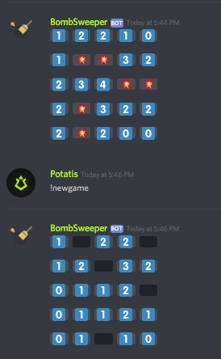

# BombSweeperBot
A discord bot that lets you play Minesweeper with the power of Spoiler tags!

The bot randomly generates a Minesweeper game board, and lets users click away the spoiler tags to unveil tiles. 

# Setup

To setup the bot yourself, basically follow [this](https://www.digitaltrends.com/gaming/how-to-make-a-discord-bot/) tutorial, 
though I've written the bot.js code for you

To use it once it's in a server, type !newgame \[grid side length\] where \[grid side length\] is between 5 and 12.

Credit to Renemari Padillo for the foundation of the bot (its ability to read chat for commands and take arguments)
